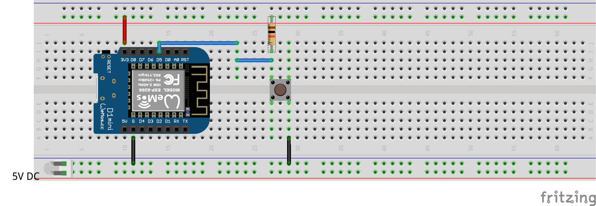

# ZenButton-MQTT Demo 
## Overview
[Mongoose-OS](https://mongoose-os.com/) demo firmware for publishing pushbutton events as MQTT messages. This firmware uses [zbutton](https://github.com/zendiy-mgos/zbutton), [zbutton-gpio](https://github.com/zendiy-mgos/zbutton-gpio) and [zbutton-mqtt](https://github.com/zendiy-mgos/zbutton-mqtt) native libraries.
## GET STARTED
Build up your device in few minutes just downloading, compiling and flashing this demo.

Clone the repo:
```bash
$ git clone https://github.com/zendiy-mgos/zbutton-mqtt-demo my-zbutton-mqtt-demo
$ cd my-zbutton-mqtt-demo
```
Enable JavaScript demo (skip to continue with C/C++ demo) :
```yaml
sources:
# - src
  - src_js
libs:
  - origin: https://github.com/mongoose-os-libs/mjs
  - ...
```
Build the binary:
```bash
$ mos build --platform <device_platform>
```
Flash the firmware:
```bash
$ mos flash --port <port_name>
```
## Hardware
### Used components
 - Wemos D1 mini board
 - Pushbutton
 - 5V DC power supply (via min-USB cable or via external power supply)
### Wiring schema

